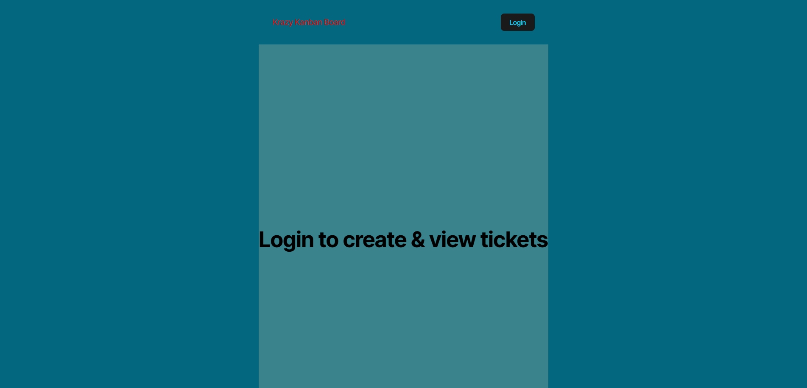

# KRAZY KABAN BOARD ULTRA

## Description 
Authentication with JSON Web Tokens (JWTs) is crucial for full-stack applications, as it provides a secure and scalable method for verifying user identities. JWTs are compact, URL-safe tokens that encode a user's authentication data, allowing servers to authenticate requests. Additionally, JWTs can include metadata and be easily verified and decoded, enhancing security while enabling seamless authentication across various parts of an application.

Your Challenge this week is to add authentication with JWT to an existing Kanban board application.

The Kanban board application has already been created. It's your job to complete the UI for the login page, add authentication with JWT to the server API, and then deploy the entire application to Render.
## Table of Contents
- [Description](#description)
- [Installation](#installation)
- [Usage](#usage)
- [Contributing](#contributing)
- [Tests](#tests)
- [Questions](#questions)

## Installation
Download it from 'code', don't forget to npm i
```
Add a .env file
DB_NAME=''
DB_USER=''
DB_PASSWORD=''
JWT_SECRET_KEY=''
```

## Usage
I WANT a Kanban board with a secure login page
SO THAT I can securely access and manage my work tasks

## Contributing
Amauri

## Tests
A lot.

## Render
(https://thekrazykabanboardultra.onrender.com)

## Video Preview
[](https://drive.google.com/file/d/12nqr0mJdbxOQ5l1N5msl-OxxsVJHNnTk/view?usp=sharing)


## Questions
For more personal questions, contact me at github.com/Amauri817
or email me @ brownamauri@icloud.com, I will try to reply as soon as I can.

## Acceptance Criteria

```md
GIVEN a Kanban board with a secure login page
WHEN I load the login page
THEN I am presented with form inputs for username and password
WHEN I enter my valid username and password
THEN I am authenticated using JSON Web Tokens (JWT) and redirected to the main Kanban board page
WHEN I enter an invalid username or password
THEN I am presented with an error message indicating that the credentials are incorrect
WHEN I successfully log in
THEN a JWT is stored securely in the client's local storage for subsequent authenticated requests
WHEN I log out
THEN the JWT is removed from the client's local storage and I am redirected to the login page
WHEN I try to access the Kanban board page without being authenticated
THEN I am redirected to the login page
WHEN I remain inactive for a defined period
THEN my session expires, the JWT is invalidated, and I am redirected to the login page upon my next action
```